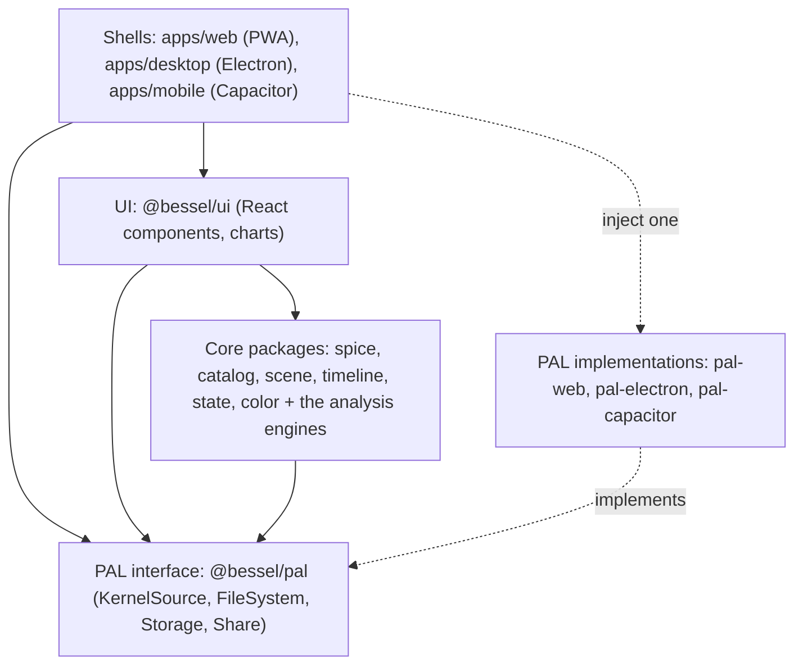
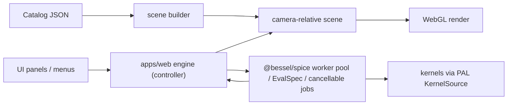

# Architecture Overview and Package Map

This is the navigable map of the monorepo: the binding layering, the 24 core
packages with one-line purposes, the data flow, and the cross-cutting mandates.
The binding decisions behind it are in docs/adr/; the requirements are in SPEC.md
(visualizer) and docs/STK_PARITY_SPEC.md (analysis engines).

## Layering (the dependency rule)

Lower layers never import higher ones, and the core never imports a concrete PAL
implementation.

```
plugins  ->  core packages  ->  PAL interface  ->  UI  ->  shells
```



- Core packages (`@bessel/spice`, `catalog`, `scene`, `timeline`, `state`,
  `color`, and the analysis engines) depend only on other core packages and the
  `@bessel/pal` interface.
- The UI (`@bessel/ui`) depends on core and the PAL interface.
- Shells inject exactly one PAL implementation at startup; the same engine then
  runs over HTTP range (web), the Electron filesystem, or Capacitor paths.

If a task tempts you to break this rule, the scope is wrong; stop and flag it.

## Core packages: visualization and platform

- `@bessel/spice`: the typed, promise-based API over CSPICE-WASM running in a Web
  Worker. Also hosts the F3 layer: the EvalSpec time-series interpreter, the
  cancellable-job protocol, the multi-worker pool, and the `PROVIDER_CATALOG`.
- `@bessel/catalog`: the native catalog schema, parsing, and the plugin registry.
- `@bessel/scene`: the camera-relative Three.js scene, the catalog-driven scene
  builder, picking, labels, and the geometry builders. SPICE-free.
- `@bessel/timeline`: the clock, event annotations, the `SpiceWindow` interval
  algebra, and the shared zero-crossing geometry finder.
- `@bessel/state`: the view-URL codec (`v=1`), the MMGIS deep-link builder, CZML
  export, and the telemetry adapter.
- `@bessel/color`: color scales (e.g. trajectory fade).

## Core packages: analysis engines

All depend only on `@bessel/spice` (for geometry) and other core packages; they
are pure where the math is pure and worker-backed where they compute over the
SPICE engine. Algorithm provenance is in REFERENCES.md.

- `@bessel/propagator`: SGP4 with TLE/OMM ingest, two-body and J2/J4 mean-element
  theory, SPK Type-13 publish, and the native Cowell HPOP (adaptive DOPRI5 with a
  pluggable force model).
- `@bessel/access`: visibility/access windows (line-of-sight, range, facility
  elevation) and chained access.
- `@bessel/events`: eclipse and lighting intervals.
- `@bessel/rf`: link budgets, antenna gain, BER, Doppler, ITU-R attenuation, and
  the comm-entity schema.
- `@bessel/coverage`: figure-of-merit reduction and Walker constellation
  generation.
- `@bessel/conjunction`: closest approach and the 2D probability of collision.
- `@bessel/attitude`: two-vector pointing laws, eigen-axis slews, and keep-out
  constraints.
- `@bessel/sensors`: field-of-view geometry, ellipsoid footprints, and swath
  accumulation.
- `@bessel/mission`: Lambert and impulsive maneuvers in the standard frames.
- `@bessel/map-projection`: equirectangular, Web Mercator, and polar-stereographic
  projections.
- `@bessel/interop`: CCSDS OEM/OMM/CDM parse, OEM-to-SPK import, and CSV/CZML
  export.
- `@bessel/analysis`: vector-geometry tools and time-series statistics.
- `@bessel/terrain`: terrain-masked line of sight.

## PAL and shells

- `@bessel/pal`: the platform-abstraction interface (`KernelSource`, `FileSystem`,
  `Storage`, `Share`). The SPICE engine never reads kernel bytes directly; kernels
  arrive through `KernelSource`.
- `@bessel/pal-web`, `@bessel/pal-electron`, `@bessel/pal-capacitor`: the three
  implementations.
- `apps/web` (the PWA, the reference shell), `apps/desktop` (Electron via
  electron-vite), `apps/mobile` (Capacitor iOS). Each injects one PAL.

## Data flow



- A loaded catalog drives the scene graph through the scene-builder seam; the same
  builder renders the bundled samples and any arbitrary mission.
- UI actions call the app's engine controller, which drives the SPICE worker
  (single client for normal rendering; the pool and `evalSeries` for heavy,
  cancellable sweeps), the clock, and the scene.
- Heavy compute stays off the main thread; series results transfer zero-copy.

## Cross-cutting mandates

- Camera-relative rendering is mandatory: positions are computed relative to the
  camera before reaching float32 GPU buffers (never raw solar-system-scale
  coordinates).
- Fail loudly: missing kernels, unresolved bodies, and bad references produce
  explicit, located, typed errors; the camera never silently re-centers.
- Kernels arrive only through the PAL `KernelSource`; never embedded, never read
  directly by the engine.
- Browser persistence uses OPFS and the PAL `Storage` interface, not ad hoc
  globals, so the PWA model holds.

## Where to go next

- docs/adr/: the binding decisions (tri-target delivery, Three.js, CSPICE-WASM,
  kernel hosting, catalog schema, plugins, AMMOS/MMGIS integration, the production
  baseline).
- docs/build-from-source.md: building each target and relinking CSPICE-WASM.
- SPEC.md and docs/STK_PARITY_SPEC.md: the requirements and the analysis-layer
  status.
- Per-package READMEs (where present): the public API and dependency rule per
  package.
